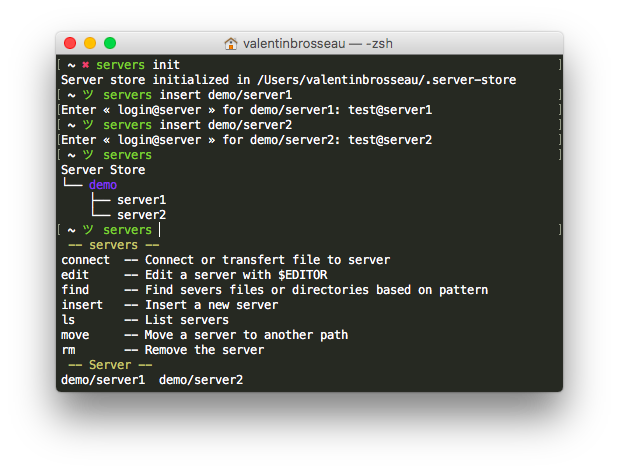

# Servers-store
> A simple command-line server connection manager system (Pass like)

I made Servers-store to answer a simple problem store all of my servers connection in the simplest way possible.



## Installation

Linux:

```sh
make install
```

OSX:

```sh
brew install gnu-getopt
make install
```


## Development setup

Servers-store is a « simple » Shell script. You can hack it directly ;)

## Release History

* 0.0.1
    * First release

## Meta

Valentin Brosseau – [@c4software](https://twitter.com/c4software) – [My Blog](https://blog.lesite.us)

[https://github.com/c4software/](https://github.com/c4software/)
